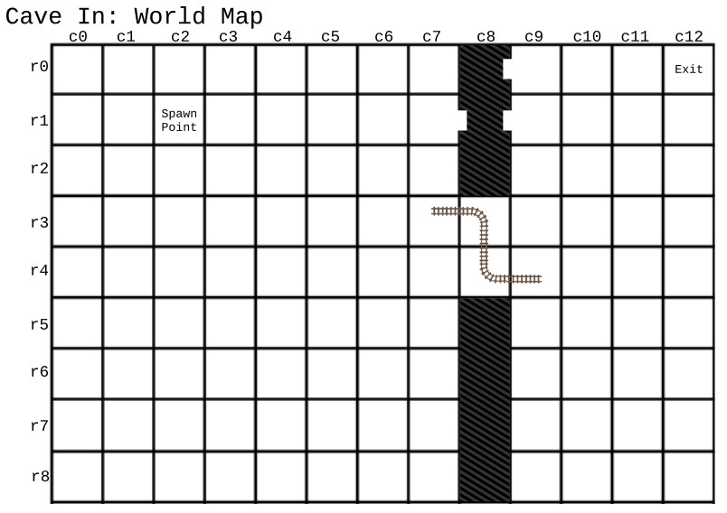

#  Lexxeous's Cave In 

Cave In is a textbased videogame based on true events, where the map is already given to you... you just need to fill it in as you go... how much history will you discover?

<a href=".pics/world_map.jpg" download>World Map Download</a>

### Introduction:

In 1948...

### Objective:

Save yourself, and your friends...

### Build, Compile, Run, and Clean:

Use the `Makefile` targets to interact with the application.

  * `make build` - // TODO
  * `make comp` - Compile the application with `g++`.
  * `make run` - Compile and run the resulting executable, starting the game.
  * `make clean` - Delete all previously compiled executables, shells, or binaries.
